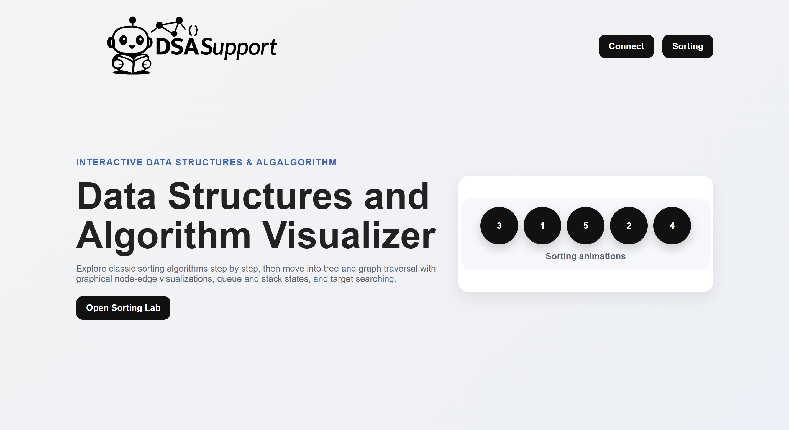
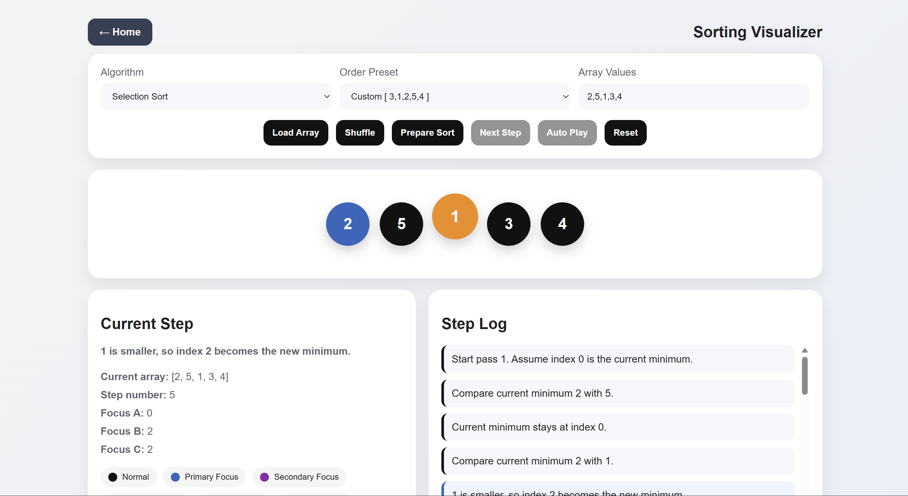

# DSA Support

Interactive **Data Structures & Algorithms Visualizer** built for learning DSA concepts step by step through animations, visual states, and readable execution logs.

## Overview

DSA Support is a browser-based educational project that helps students understand how common algorithms and data structures work visually.

The project currently includes:

- A **Sorting Visualizer** with step-by-step playback
- A simple homepage that introduces the labs and learning goals

## Features

### Sorting Visualizer
- Bubble Sort
- Selection Sort
- Insertion Sort
- Merge Sort
- Quick Sort
- Shell Sort

You can:
- load a custom array
- use preset arrays
- shuffle values
- prepare the algorithm first
- move **one step at a time**
- use **auto play**
- reset and try again
- read the **step log** and current state metadata

## Tech Stack

- **HTML**
- **CSS**
- **JavaScript**

No external framework is required. The project runs directly in the browser.

## Project Structure

```bash
DSASupport/
├── index.html          # Homepage
├── sorter.html         # Sorting visualizer page
├── script.js           # Sorting visualizer logic
├── styles.css          # Shared styling
└── resources/          # Images / assets
```
### How to Run

1) Open Directory
   Download or clone the repository, then open index.html in your browser.
2) Clone with Git
   <br>`git clone https://github.com/pasindumanahara/DSASupport.git`<br>
   `cd DSASupport`

### Usage

1) Open the sorting visualizer
2) Choose an algorithm
3) Enter array values seperated by commas
4) Click **Load Array**
5) Click **Prepare Sort**
6) Use **Next Step** or **Auto Play**

### Learning Goals

This project is designed to help learners:
- understand how sorting algorithms transform arrays over time
- compare different sorting strategies visually

### Future Improvements

- Linked List visualization
- Stack and Queue operations
- Heap and BST visualizers
- Speed control slider
- Better mobile responsiveness
- Dark/light theme toggle
- Complexity display for each algorithm
- Code panel for each algorithm

### Screeshots

**Home Page**


**Sorting Page**


### Contributing

Suggestions and improvements are welcome. Feel free to fork the repository and submit changes.

### Author

<a href='[https://](https://pasindumanahara.github.io/)'>Pasindu Manahara</a>

## License

This project is licensed under the MIT License - see the [LICENSE](LICENSE) file for details.
